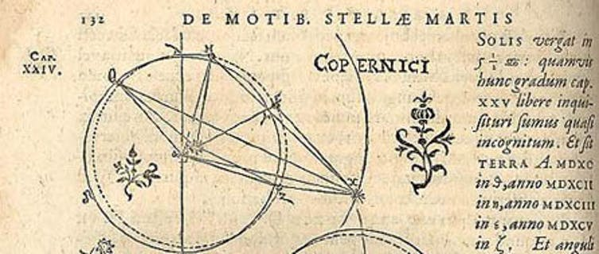
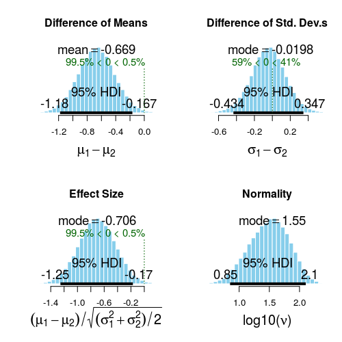
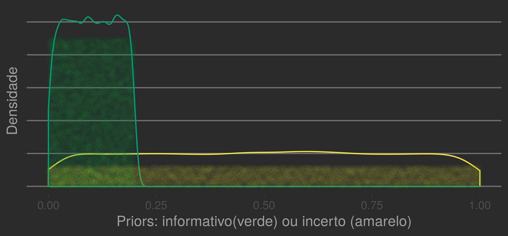

---
output:
  pdf_document: default
  html_document: default
---
# Chapter 5: Bayesian Context and Inference

## Probabilities
*For that which is probable is that which generally happens*. Aristotle, Rhetoric.

A probabilistic approach to applied mathematics that has become popular is * Bayesian Inference *. The procedures presented before are usually called *frequencists*.
Often, the information obtained is almost identical, but the perspective changes considerably.  

By principle, we use different paths.  

**Frequencists and Bayesians**

Frequencist approaches place probabilities as approximations for scenarios with an infinite number of events. The examples visited in the first chapters use this analogy.  

Returning to a trivial example: if we play an honest coin endlessly, the relative frequency of *heads* converges to what value? For large trials, it approximates 0.5.  

Simulation:  
```julia
    julia>using Random
    julia>Random.seed!(2600)
    julia>function trial_t(n_trials::Int)
        r_trials = bitrand(n_trials) |> x -> map(Int64,x)
        sum(r_trials)/length(r_trials)
    end  
    julia> trial_t(10)
    0.6      
    julia> trial_t(100)
    0.43       
    julia> trial_t(1000)
    0.482      
    julia> trial_t(100000)
    0.50019      
    julia> trial_t(10000000)
    0.4999909
```  
The notion of hypothetical infinite populations or procedures os fairly common.  
The hypothetical-deductive method relates theories to observations through falsifiable hypotheses. The most accepted conception, recently compiled by K. Popper, deals directly with probabilities as important entities for the natural sciences.  
More than that, it illustrates the concept of calculating the plausibility of experimental results considering the validity of a given hypothesis being studied.  

We calculate probabilities associated with the occurrence of an observation. In the t-test for two samples (chapter 1), we defined the null hypothesis as a function of the sample means ($\mu$) and other parameters ($\sigma$, $\text{df}$).  
$$H_{0}: \mu_{sample_{1}} = \mu_{sample_{2}}$$.  

The procedure of imagining events observed as instances of a family of similar events is perfectly suited to Popperian precepts. It is also expressed in Hugh Everett`s *Many-Worlds* interpretation of naturally probabilistic phenomena in quantum mechanics. It remains the bread and butter of normal science to test predictions of a particular paradigm. The gradual refinement of a theory involves the accumulation of knowledge and testing of *auxiliary hypotheses* resulting from basic assumptions (*hard core* using Imre Lakatos terminology).  

Bayesian prisms orchestrate probabilities as primitive beings. A basic notion related to *plausibility*, *degree of belief*, *expectation* for a given situation.  
The key point is that we no longer guide the procedures aiming at a probability for events.  
The probabilities themselves become central entities. Specifically, how our beliefs about something is changed after observations.  

In the case of Darwin`s birds:  

*Frequencist*: Assuming the average size difference between samples is 0, what is the probability for my observations?  
Since $H_{0}$ is defined by $H_{0}: \mu_{sample_{1}} = \mu_{sample_{2}}$, we want to know:  
$P(H_{0}) < 0.05$?   

*Bayesian Inference*: What are the probabilities describing possible values for the difference between $\text{sample}_{1}$ and $\text{sample}_{2}$? Considering a model and the data, what is the probabilistic distribution of $\mu_{\mathit{diff_{1-2}}}$  
$$P(\mu_{\mathit{diff_{1-2}}})=?$$  

In addition to intuitive constructs, a Bayesian platform offers two powerful features:   sensitivity to prior information about a phenomenon (*priors*) and stochastic estimators (eg* Markov Chain Monte Carlo*) are an efficient way. Thus, we can (1) make use of arbitrary information (e.g. expert intuition) and (2) reduce the dependence of (closed) analytic solutions to equations describing the models.  

---  

#### Bayesian Epistemology?

Previously, we associated scenarios with hypotheses and estimated parameters (probabilities) to test them. Now, *parameters* have a central conceptual role.  

A parameter is a symbol, an approximation for an idea (*para*, "near", *metron*, "measure"). In the initial chapters, we use parameters for constructs that behave as numbers (e.g. there are elements that can be ordered by some notion of size, and operations such as sum and multiplication).  

We estimated parameters ($\mu_{\text{diff}}$ and p value) to test a hypothesis about the mean difference between in beak size among species A and B. In Chapter 2, we used a parameter ($\beta$ and a p value) to test a hypothesis about the correlation between healthy life expectancy and number of doctors in a country. More than that, we used the corresponding statistics to test hypotheses and calculate confidence intervals.  

It is very difficult to understand the usefulness of previous procedures by not knowing the hypothetical-deductive north leading them. The following excerpt is in *Data Analysis, The Bayesian Tutorial* (Sivia & Skilling, 2006), from Oxford professors: *"The masters, such as Fisher, Neyman and Pearson, provided a variety of different principles, which has merely resulted in a plethora of tests and procedures **without any clear underlying rationale**. This **lack of unifying principles** is, perhaps, at the heart of the shortcomings of the cook-book approach to statistics that students are often taught even today."*  

We could use probabilities obtained via Bayesian inference to continue testing hypotheses. However, it is convenient to introduce Bayesian tools to the thinking of philosophers who have offered other alternatives [^ 27].  

[^ 27]: There is a more comprehensive research program in philosophy on Bayesian epistemology, but this is not our focus. Check [The Open Handbook of Formal Epistemology](https://jonathanweisberg.org/post/open-handbook/)

## More than one scientific methods: Feyerabend, Carnap and Quine

In the first chapter, we met the hypothetical-deductive method and falsifiability as the criterion of scientific demarcation. Although dominant, this rational has interesting vulnerabilities. We will better understand opposing arguments and alternative proposals through three twentieth-century philosophers. This is convenient time, as we turn the spotlights away from hypotheses.  

**Paul Feyerabend (1924 - 1994)**  

Known for his unique personality and radical ideas, Paul Feyerabend, in "Against Method" (1975), argues that most of historical breakthroughs occurred desregarding the scientific method.  

Personal beliefs and biographical details are responsible for changes in our knowledge. Moreover, using falsifiability and the hypothetical-deductive method would have made us reject heliocentrism and other key ideas for progress. In fact, Ptolemy's geocentric system (Earth at the center of the system) was better than that of Copernicus (Sun at the center) using the same number of parameters for calculations of orbits. The Copernican model was closer to reality as it is understood today, but the intermediate stage of theoretical conception was 'worse' [^28].  

In addition to being less accurate, it was more complex in some respects, including more epicycles: auxiliary orbits used as artifice for calculations. The Copernican Revolution only consolidated the paradigm shift with subsequent contributions by Tycho Brahe, Kepler, Galileo, and Newton, about 1 century later.  

  

[^28]: Stanley E. Babb, "Accuracy of Planetary Theories, Particularly for Mars," Isis, Sep. 1977, pp. 426  

Faced with the conflicts between a method and the inevitable unpredictability of human endeavor to know the Universe, Feyerabend proposes epistemic anarchism under the motto "Anything goes". That is, any assets are valid when attempting to attack a problem or designing a model of reality.  

It is tempting to think that, given the depth of the work, defending such a blunt posture is an application of the precepts defended in the book as necessary to disseminate an idea. Other philosophers help us to conceive of a science not based on a hypothetical-deductive method in a less radical way.  

\pagebreak

**Rudolph Carnap (1891 - 1970)**

Carnap, a member of the Vienna Circle, also countered Popper. In "Testability and Meaning" (1936-7), he argues that falsifiability does not differ from verificationism. It involves testing each assertion itself, a problem that [others] (https://plato.stanford.edu/entries/wittgenstein/) also addressed.  
 
Faced with unexpected results in an experiment, the instinctive procedure for a scientist involves checking the integrity of the drawn conditions. Verifying sample composition, collection methods, data loss mechanisms, exclusion and inclusion criteria, assumptions of the analysis. This is not intellectual dishonesty: they are plausible, easily fixable factors that may have invalidated the underlying theory given result experiments. The same goes for techniques of analysis and conceptualization of constructs.  

Addressing these points is desirable and exposes the inevitable Achilles heel in falsifiability.
It is impossible to refute a hypothesis / assertive in isolation. Each experimental or logical procedure involves an interdependence between its components.  

**Willard van Orman Quine (1908 - 2000)**  

A philosophical school starts from the problem above. Duhem-Quine's thesis postulates that it is impossible to test any scientific hypothesis, since there are always assumptions postulated to be true.  

In 'The Two Dogmas of Empiricism', Quine considers propositions and logical relations between to be a single system, which can only be studied as a whole.  
The exercises illustrated in the previous volume test the adequacy of the data to the distribution family *t*. It also assumes that beak sizes are measurable using numbers and that these can be compared with values from other samples.

At first these statements seem trivial. However, considering the human aspects of science, changes in perspective are significant. Arguably, addressing a problem in this way is historically more fruitful. The most compelling contributions come from scientists dedicated to studying a context or problem as a whole. It is rare, perhaps unheard of, that a group testing hypotheses without a strong underlying theoretical axis has made remarkable strides.  

In that sense, freely estimating the parameters we are talking about naturally is much more intuitive than tailoring an idea to hypothetical-deductive procedures.  

## Bayesian Inference

In Chapter 1, during a *t* test, we compute the *t* statistic corresponding to the differences found and then the probability of obtaining equal or more extreme values.
It is possible to use Bayesian inference to analyze an identical situation. However, we are no longer interested in the p value.
The question is *"What are the likely values for the difference between A and B?"*.  

The probabilistic distribution obtained is a representation of our beliefs in the plausibility of each value.  

Using the library BEST and 30 observations taken from normally distributed  samples $(\mu_{a}=0; \mu_{b}=0.6; \sigma_{a} = \sigma_{b} = 1)$.  

```r
    > library(ggthemes)
    > library(rstan)
    > library(reshape2)
    > library(BEST)
    > library(ggplot2)
    > options(mc.cores = parallel::detectCores() - 1)
    > set.seed(2600)
    > a <- rnorm(n = 30, sd = 1, mean = 0)
    > b <- rnorm(n = 30, sd = 1, mean = 0.6)

    # BEST
    > BESTout <- BESTmcmc(a, b)    

    ### BEST plots
    > par(mfrow=c(2,2))
    > sapply(c("mean", "sd", "effect", "nu"), function(p) plot(BESTout, which=p))
    > layout(1)
```


The distribution on the upper left corner corresponds to our estimates for plausible values of the difference between A and B. We can use the mean as a point estimate: $(\mathit{diff}_{\mu_{a}\mu_{b}}=-0.669)$. The range labeled as '95% HDI' (High Density Interval) contains 95% of the distribution.  
Its meaning is closer to the intuition of a region likely to contain real values than standard confidence intervals obtained in frequentist procedures.  

### Behind the curtains  

Obviously, we wil understand the art involved here. The flexibility and power of Bayesian models allow us to deal with a series of problems that are difficult to treat in any other way. However, it is also easier to find pitfalls or run into difficulties during the process.  

It is extremely important to understand the components involved, so as not to make major mistakes.  

  

### The Bayes Theorem  

$$P(B\mid A)= \frac{(A \mid B)P(B)}{P(A)}, P(A)\neq 0$$
The classical form of the theorem tells us about probabilities of subsequent/concurrent events.  

It is often presented to treat simple problems: *Knowing the result of a positive medical test, how likely is the patient to have the disease?*. Bayes' theorem relates the baseline probability of disease with the probability a subsequent positive test. Some results contradict intuition: even if the test has good sensitivity (high probability of positive results in the face of the disease), the probability will remain low if the baseline chances are also low.  
 
The theorem was conceived in a greater effort of the Reverend Thomas Bayes (1701-1761) for an inference problem. Curiously, it is quite similar to what we will face.  
Suppose we assign a probability *p*($0 \leqslant p \leqslant 1$) to coin trials *tails* result. By looking at some results, we can make our estimate.
We can start by assuming an honest $0.5$ coin. With a high frequency of *tails*, it is rational to increase our estimate of *p* $(p \sim 1)$. Bayes demonstrated how to make these updates in the face of new evidence.  


#### Intuitions  

The text of **An essay towards solving the Problem in the Doctrine of Chances (1973)** presents a series of demonstrations until arriving at the statement:  
**Proposition 4** : *If there be two subesequent events be determined every day, and each day the probability of the 2nd [event] is $\frac{b}{N}$ and the probability of both $\frac{P}{N}$, and I am to receive N if both of the events happen the 1st day on which the 2nd does; I say, according to these conditions, the probability of my obtaining N is $\frac{P}{b}$. (...)*  

The style is a bit complicated. Rephrasing:  
Consider two subsequent events: *(1)* the probability of the second happening is é $\frac{b}{N}$ ($P(A)$), *(2)* the probability of both occurring is $\frac{P}{N}$ ($P(A \cap B$). *(3)* Knowing that the second happened, the probability that the first one also happened is $\frac{P}{b}$.  $N$ é cancelado e *(3)* é a razão entre *(2)* e *(1)*:  
 
$$P(B\mid A)= \frac{P(A \cap B)}{P(A)}, P(A)\neq 0$$  

Considering two events, **A** and **B**, the probability of B occurring knowing that A happened ($P(B\mid A)$) is identical to the probability of A and B ($P(A \cap B)$) occuring, normalized by the probability of A occurring individually.  

By the definition of conditional probability, $P(A \cap B) = P(A \mid B) P(B)$, then:  

$$P(B\mid A)= \frac{(A \mid B) \space P(B)}{P(A)}, P(A)\neq 0$$  

Thus, we can estimate probability for events. In Bayesian inference, we use the theorem to estimate plausible values (probabilistic distribution) for a given parameter ($\theta$) on the face of observations ($X$).  

$$P(\theta \mid X) = \frac{ P(X \mid \theta) \space P(\theta) }{P(X)}, P(X) \neq 0$$

#### Posterior  
We call the first term, the parameter estimate after calibration by the observations $P(\theta \mid X)$, **posterior distribution**. All procedures are designed to calculate it and represent the distribution used for final inferences.
In our example, we would want the posterior distribution of the values for the difference between A and B.    

#### Marginal Probability  
The denominator of the term on the right is the independent probability for occurrence of the observations ($P(X)$). It is used to normalize quantities and we call it **marginal probability**, **marginal likelihood**, or even **model evidence**.    


#### Likelihood  
We call the first term on the right, $P(X \mid \theta)$, **likelihood**. It determines the probability of occurrence of observations $P(X)$ given a parameter $\ theta$.  
It is probably the most sensitive point in modeling, since *it describes how the relation between theoretical model and observations occurs*. As discussed earlier, equations correspond to precise laws involving more than one construct. The mapping between observations $P(X)$ and a parameter is given by the **likelihood function**, $f(\theta)$.  
Example: The number of combat white cells circulating in the blood is associated with an inflammatory response. The higher, the more likely that an infection is occurring. But what law associates the number of cells (between $0$ and $10^5$) with  probabilities of infection?  
If the outcomes studied are binary ($y_{i} \in  \{ 0,1 \}$, e.g. positive or negative diagnosis), we can use a logistic relation (see Chapter 4) to estimate probabilities against observed variables ($X$) and parameter (s) $\theta$.  
$$P(X \mid \theta) \sim f(X, \theta) : y_{i} = \frac{1}{1+e^{-(\theta * x_{i} + c)}}$$  
Other functions could be chosen, such as the Heaviside step from the previous chapter. This depends on the phenomenon, the theory and the measures analyzed.  

#### Priors  
How do we estimate the infection probabilities before seeing the test results? Before the exam, we have some notion of how the parameter behaves.  
It can be very accurate or it can bring a lot of uncertainty. We call the basal estimate $P(\theta)$ **prior** and it appears in the expression multiplying the likelihood value.  
In the language of probabilities, it is a distribution. Our prior beliefs may be poorly informative (e.g., we did not examine the patient: uniform distribution over possible values) or fairly defined (e.g., patient is asymptomatic: distribution almost entirely concentrated in the proximities of 0).  


```r
    > a <- runif(10000)
    > b <- runif(10000, min = 0, max=0.2)
    > priors <- data.frame(uniform=a, low=b)
    > ggplot(priors)+
    geom_density(aes(x=uniform),color="#F0E442")+
    geom_jitter(aes(y=uniform*4.5,x=seq(0,0.2,length.out = 10000)),
    color="#009E73",alpha=0.015)+
    geom_density(aes(x=low),color="#009E73")+
    geom_jitter(aes(y=low*3,x=seq(0,1,length.out = 10000)),
    color="#F0E442",alpha=0.01)+ylab("Densidade")+
    xlab("Priors: informativo(verde) ou incerto (amarelo)")+
    theme_hc(style="darkunica")+theme(axis.text.y=element_blank())

```
  

Knowing our constructs, we can then rewrite procedures:
$$\text{Posterior} = \frac{\text{Probabilities for observations given} f(X,\theta) * \text{Prior}}{\text{Marginal probabilities for observations}}$$   

To obtain the *posterior* distribution, we multiply the probability given by the *likelihood function* by our previous estimates (*prior*) and normalize them by the *marginal probability* of the observations.

Subsequent results are constructed according to the distribution of the *later*.  

---  

**Mestre Foo e o Recrutador**[^29]  

A technical recruiter, having discovered that that the ways of Unix hackers were strange to him, sought an audience with Master Foo to learn more about the Way. Master Foo met the recruiter in the HR offices of a large firm.  

The recruiter said, “I have observed that Unix hackers scowl or become annoyed when I ask them how many years of experience they have in a new programming language. Why is this so?”  

Master Foo stood, and began to pace across the office floor. The recruiter was puzzled, and asked “What are you doing?”  

“I am learning to walk,” replied Master Foo.  

“I saw you walk through that door” the recruiter exclaimed, “and you are not stumbling over your own feet. Obviously you already know how to walk.”  

“Yes, but this floor is new to me.” replied Master Foo.  

Upon hearing this, the recruiter was enlightened.  

[^29]: http://www.catb.org/~esr/writings/unix-koans/recruiter.html  

---  

### Dear Stan

The Bayesian models here are implemeneted with Stan, a C ++ package specialized in Bayesian inference. The models are written in a dialect of their own, but the syntax is quite similar to that of standard mathematical notation, so the translation of the chapter analyzes is straightforward.
We specify the model in an * .stan * extension file, which is handled by wrappers (e.g. rstan, CmdStan.jl) for visualization and other utilities.  

**There and back again**  

We shall reproduce two known examples in the Bayesian manner: difference between means (analogous to test t) and correlation.

Here we make it clear that the rational is more direct than the former procedures of hypothesis testing.  

#### Comparing Normal Distribution Samples

Let us recall (Chapter 1) that in order to compare samples using the t test: (1) we assume our sample is taken from a population whose measure are normally distributed values; (2) we imagine the distribution of normalized means in similar hypothetical samples taken from the same population: they folow a Student`t distribution; (3) we compute the p value according to *t* statistic calculated with observed data: mean ($\mu$) and sample size ($n \sim df_{t}$).  

Instead, we can now obtain a *posterior distribution* for the difference between samples.  
(1) As before, we assume normality (*likelihood function*) of values in the population; (2) we provide our previous estimates (prior) of such difference; (3) we update the values considering the data and to obtain the *posterior*.  

Let`s use the following parameterization:  

Values observed in samples 1 and 2, vectors $N$ dimensions: $y_{1}, y_{2}$  
Unknown target parameters, the means in each sample, and a common standard deviation:  $\mu_{1}, \mu_{2}, \sigma$  
Priors assuming mean 0 in both groups and standard deviation of 1: $mu_{1} \sim N(0,1), mu_{2} \sim N(0,1), \sigma \sim N(1,1)$  
Likelihood function, indicating that each observation is taken from a population whose value are normally distributed: $y \sim N(\mu,\sigma)$  

We also set Stan to generate (1) values for the difference between the posterior distributions of $\mu_{1}$, $\mu_{2}$, $\mu_{\text{diff}}$ and (2) effect size with Cohen's D, dividing the value by the standard deviation.  

The code should be passed as a string of saved to ".stan" file.  

```
data {
  int<lower=0> N;
  vector[N] y_1;
  vector[N] y_2;
}
parameters {
  real mu_1;
  real mu_2;
  real sigma;
}
model {
  //priors
  mu_1 ~ normal(0, 1);
  mu_2 ~ normal(0, 1);
  sigma ~ normal(1, 1);
 
  //likelihood - Verossimilhanca
  for (n in 1:N){
    y_1[n] ~ normal(mu_1, sigma);
    y_2[n] ~ normal(mu_2, sigma);
  }
}
generated quantities{
  real mudiff;
  real cohenD;
 
  mudiff = mu_1 - mu_2;
  cohenD = mudiff/sigma;
}
```

Then we start the analysis through the interface in R. We create a list with components homonymous with the Stan file variables (y_1: sample 1, y_2: sample 2, N: sample size).  

```r
    > a <- rnorm(n = 100, sd = 1, mean = 0)
    > b <- rnorm(n = 100, sd = 1, mean = 0.6)
    > sample_data <- list(y_1=a,y_2=b,N=length(a))
    > fit <- rstan::stan(file="aux/bayes-t.stan",
           	data=sample_data,
           	iter=3000, warmup=100, chains = 6)
     SAMPLING FOR MODEL 'bayes-t' NOW (CHAIN 1).
     (...)
```
The above command will start the calculations. Let us plot the posterior distributions of $\mu1$, $\mu2$, and the difference between these ($\mu_{\text{diff}}$).  

```r
    > obs_diff <- mean(a) - mean(b)
    > obs_diff
    [1] -0.5579295
    > posteriors <- extract(fit,par = c("mu_1","mu_2","mudiff"))
    > lapply(posteriors,mean)
    $mu_1
    [1] 0.07303457    

    $mu_2
    [1] 0.6261336    

    $mudiff
    [1] -0.553099
    > ggplot(data.frame(muDiff=posteriors$mudiff), aes(x=muDiff))+
       geom_histogram(alpha=0.6,color="green")+
       geom_vline(xintercept=obs_diff,
              	color="light blue",size=1)+ # line for observed difference
       xlab("Distribuição para diferença de médias")+ylab("")+ ylim(0,2500)+
       geom_text(label="Diferença observada:\n -0.557",
             	color="white",x=mean(muDiff)+0.05,y=2000)+
       theme_hc(style="darkunica")+
       theme(axis.text.y=element_blank())       	
```


The distribution above contains further information. We missed the elegant Student's analytic estimate to test the hypothesis on a parameter (e.g., $H_{0}: \mu_{\text{diff}} = 0$). On the other hand, we have a global view on the entire estimated distribution for $\mu_{\text{diff}}$!  

--- 

#### Correlação linear  

Reproduziremos a análise de correlação do capítulo 2, quando falamos em indicadores de saúde. As variáveis importantes são o logaritmo do número de médicos e a expectativa de vida saudável (Health Adjusted Life Expectancy). O banco foi criado com nome `uni_df`, contendo as variáveis `log_docs` e `hale`.  

Sistematizando nossa abordagem, vamos escolher **Priors:**  
*Correlação* $\rho$: Vamos assumir que ela é positiva entre número de médicos e expectativa de vida saudável. Vamos indicar um valor baixo (0,1) para essa correlação.
$$N(0.1,1)$$  
*Médias e desvios* $\mu$ e $\sigma$: Não temos muita idea média para o logaritmo do número de médicos. Uma leve inspeção mostra que os valores têm baixa magnitude. Vamos indicar priors pouco informativos para $\mu_{\text{medicos}}, \sigma_{\text{medicos}}$ na forma de gaussianas de média 0 e desvios altos.   
$$\mu_{\text{medicos}} \sim N(0, 2), \sigma_{\text{medicos}} \sim N(0, 10)$$  
Uma breve consulta em mecanismos de busca sugere que uma média $\mu_{\text{hale}}$ de *60* anos seja um chute razoável. Vamos estimar o prior do desvio-padrão $\sigma_{\text{hale}}$ em 5.  
$$\mu_{\text{hale}} \sim N(60, 3), \sigma_{\text{hale}} \sim N(5, 2)$$


**Likelihood function:** Nosso modelo para os dados é de que eles são dados através de uma distribuição normal bivariada, com médias $\mu_{1},\mu_{2}$ e desvios $\sigma_{1},\sigma_{2}$. Como vimos antes, a definição para o coeficiente de Pearson entre as amostras $X$ e $X'$ é
$$\rho_{XX'}= \frac{cov(X,X')}{\sigma_{X}\sigma_{X'}}$$
Então, 
$$cov(X,X') = \sigma_{X}\sigma_{X'} * \rho_{XX'}$$  
Podemos então definir a matriz de covariância de nossa distribuição bivariada:  
$$\text{Cov. Matrix} = \begin{pmatrix} 
\sigma_{1}^2 & \sigma_{1}\sigma_{2'} * \rho  \\ 
\sigma_{1}\sigma_{2'} * \rho & \sigma_{2}^2  \end{pmatrix}$$

Nosso código em Stan:
```
data {
	int<lower=1> N;
	vector[2] x[N];  
}

parameters {
	vector[2] mu;             
	real<lower=0> sigma[2];   
	real<lower=-1, upper=1> rho;  
}

transformed parameters {
	// Matriz de covariancias
	cov_matrix[2] cov = [[  	sigma[1] ^ 2   	, sigma[1] * sigma[2] * rho],
                     	[sigma[1] * sigma[2] * rho,   	sigma[2] ^ 2   	]];
}

model {
  // Priors
  sigma ~ normal(0,1);
  mu ~ normal(0.2, 1);
  
  // Likelihood - Bivariate normal
  x ~ multi_normal_lpdf(mu, cov);
    
}

generated quantities {
  // Amostras com pares ordenados
  vector[2] x_rand;
  x_rand = multi_normal_rng(mu, cov);
}
```
E então podemos iniciar as estimativas.  

```r
    # Stan não aceita missing values
    > c_cases <- uni_df[complete.cases(uni_df[,c(3,4)]),] 
    > vec_2 <- matrix(data = c(c_cases$hale,c_cases$log_docs),ncol = 2,nrow = 145)
    > health_data  <- list(N=nrow(c_cases),x = vec_2) 
    > fit <- rstan::stan(file="aux/corr-docs.stan",
           	data=health_data,
           	iter=3000, warmup=120, chains = 6)
    SAMPLING FOR MODEL 'corr-docs' NOW (CHAIN 1).
    (...)
```
E então, vamos observar nossa estimativa posterior para o valor de $\rho$:  
```r
    > obs_rho <- cor.test(vec_2[,1],vec_2[,2])$estimate
    > posterior <- rstan::extract(fit,par = c("rho"))
    > ggplot(data.frame(rho=posterior$rho), aes(x=rho))+
       geom_density(alpha=0.6,color="green")+
       geom_vline(xintercept=obs_rho,
              	color="light blue",size=1)+ # line for observed difference
       xlab("")+ylab("")+ xlim(-1,1)+
       geom_text(label="Valor observado \n 0.841",
             	color="white",x=obs_rho-0.1, y = 5,
             	size=3)+
       geom_text(label="Média do posterior \n 0.833",
             	color="white",x=obs_rho-0.05, y = 13,
             	size=3)+
       theme_hc(style="darkunica")+
       theme(axis.text.y=element_blank()) 
```


Notamos que as estimativa posterior para $\rho$ foram razoavelmente distruídas ao redor do valor empiricamente calculado na amostra. Podemos ainda observar na distribuição  intervalos com alta densidade de probabilidade (HDI, High density intervals) ou ainda outros fins.  

```r
    > quantile(posterior$rho,probs = c(0.025,0.5,0.975))
         2.5%       50%     97.5% 
    0.7790645 0.8353651 0.8777544  
    > cor.test(vec_2[,1],vec_2[,2])$conf.int
    [1] 0.7854248 0.8828027
```  

O HDI muitas vezes é próximo do intervalo de confiança como calculado tradicionalmente, mas isso não é garantido.  

Podemos plotar nossa amostra aleatória gerada a partir do posterior e inspecionar visualmente como os valores da amostra estariam dentro da probabilidade estimada.  

```r
    >x.rand = extract(fit, c("x_rand"))[[1]]
    >plot(uni_df[,c("log_docs","hale")], 
     	xlim=c(-5,5), ylim=c(20, 100), pch=16)
    >dataEllipse(x.rand, levels = c(0.75,0.95,0.99),
            	fill=T, plot.points = FALSE)
    > sample_data <- data.frame(x.rand)
    > names(sample_data) <- c("HALE","Logdocs")        	
    > ggplot(sample_data,aes(x=Logdocs,y=HALE))+
         geom_point(alpha=0.1,color="green",size=2)+
         xlab("Log (Número de Médicos) ") + ylab("HALE")+
         geom_point(data=uni_df,aes(x=log_docs,y=hale),color="yellow")+
                theme_hc(style="darkunica")
```


Você pode experimentar com diferentes priors (famílias e parâmetros) observando como o valor final muda.  

### Estimadores e métodos Markov Chain Monte Carlo

Nas implementações acima, partimos da equação envolvendo priors, likelihood e probabilidades marginais.  
$$P(\theta \mid X) = \frac{ P(X \mid \theta) \space P(\theta) }{P(X)}, P(X) \neq 0$$
Usando Stan, informamos priors, a função de verossimilhança, observações e todo o trabalho sujo é realizado sem mais esforços.  
A estimativa de $P(\theta \mid X)$ pode ser feita de diferentes maneiras.  
Uma delas envolve partir de uma distribuição $P(\kappa)$ e gradualmente minimizar uma medida da diferença (em geral, a *divergência de Kullback-Leibler*) entre ela e $P(\theta \ mid X)$. Esses métodos (cálculo variacional, *Variational Bayesian methods*) envolvem soluções analíticas para cada modelo.  
Abordaremos um outro método: **Markov Chain Monte Carlo**.  

#### Nem todos que andam sem destino estão perdidos
[^30]  

**Soluções fechadas**   

Quando falamos em regressão (Cap. 2), estimamos as inclinações de reta $\beta_{i}$. Lançamos mão de uma *função de verossimilhança* *(likelihood function)*, com o mesmo sentido aqui empregado, definindo a probabilidade das observações dado um modelo teórico.  

Obtivemos soluções que maximizassem essa função *(maximum likelihood)*. Para o caso da regressão linear, apontamos soluções fechadas 
$$\text{Max log likelihood}(\beta_{0},\beta_{1},\sigma^{2})$$
$$=\text{Max log} \prod_{i=1}^{n} P(y_{i}|x_{i}; \beta_{0},\beta_{1},\sigma^{2})$$
Por exemplo, o coeficiente angular ($\beta_{1}$) é  
$$\hat{\beta_{1}}=\frac{cov(XY)}{\sigma_{x}^{2}}$$  

**Gradient Descent**  

No capítulo 4, mostramos outra maneira de estimar parâmetros, analisando uma função de perda. Usando derivadas parciais, calculamos o gradiente, análogo à *inclinação* de uma superfície em 3 dimensões. Isso foi possível pois sabíamos as derivadas em cada nodo (neurônio). A rede consiste no sequenciamento de unidades em camadas, então a regra cadeia funciona perfeitamente (*backpropagation*).  

$$(g \circ f)' = (g'\circ f)f'$$

**Markov Chain Monte Carlo**  

Estimadores Markov Chain Monte Carlo (MCMC) funcionam para tratar problemas sem solução fechada e em que não sabemos os gradientes com exatidão.  
Outras formas de tratamento existe. Aqui abordamos uma estratégia de MCMC chamada Metropolis-Hastings. Para estimar nosso posterior, $P(\theta \ mid X)$, usamos um algoritmo que permite obter amostras representativas de $P(\theta \ mid X)$. Para isso, a condição é de que exista uma função $f(x)$ proporcional à densidade de $P(\theta \ mid X)$ e que possamos calculá-la.  

1 - Começamos com parâmetros em um estado (e.g. $s_{0} : \beta_{0} = 0.1 , \beta_{1} = 0.2$) e analisamos a função (e.g. $f: \text{log likelihood function}$) naquele estado ($f(s_{0})$) considerando os parâmetros em $s_{0}$. 
2 - Em seguida, damos um passo em direção aleatória, modificando dos valores de $\beta_{i}$. Uma opção bastante usada é a de uma gaussiana com centro no estado anterior (*random walk*). Reavaliamos o estado ($f(s_{1})$).  
2.1 - Se ele é mais provável, $f(s_{1}) > f(s_{0})$, então $s_{1}$ é aceito como novo ponto de partida.  
2.2 - Se ele é menos provável, mas próximo o suficiente do estado anterior, $f(s_{1}) - f(s_{0}) < \epsilon$, também tomamos $s_{1}$ como ponto de partida para o próximo passo aleatório.  
2.3 - Se ele é menos provável com uma margem grande, $f(s_{1}) - f(s_{0}) > \epsilon$, rejeitamos $s_{1}$ e sorteamos um novo estado aleatório.  

O processo caminha para estados mais prováveis, com alguma probabilidade de visitar estados menos prováveis. Se a função escolhida é proporcional à densidade do posterior, $f(x) \sim \text{dens}(P(\theta \ mid X))$, as frequências de parâmetros na amostra de estados visitados,$s_{i}$, correspondem ao posterior. É uma prática comum descartar as primeiras iterações (*warm up*), pois os valores ser muito representativos de locais com baixa densidade.  

[^30]: All that is gold does not glitter,/*Not all those who wander are lost*; The old that is strong does not wither,/ Deep roots are not reached by the frost./From the ashes, a fire shall be woken,/A light from the shadows shall spring;/Renewed shall be blade that was broken,/The crownless again shall be king.  **J.R.R Tolkien. The Fellowship of the ring 1954,**

#### Equações

Para fins práticos, vamos trabalhar com um parâmetro desconhecido $\mu$ e considerar $\sigma^{2}=1$. 

A função $f$ proporcional deve ser proporcional à densidade do posterior.  

$$\text{Posterior} \propto \frac{\text{Prior} \times \text{Likelihood}}{\text{Prob. Marginal}}$$  

**Probabilidades marginais**
É a probabilidade das observações $P(X)$. Elas são constantes no processo, servindo apenas para normalizar estimativas, então:
$$\text{Posterior} \propto \text{Prior} \times \text{Likelihood}$$  

**Priors**  
Nosso prior é normal, com média 0 e desvio-padrão 1, $P(\mu) \sim N(0,1)$.  

**Likelihood**
Se as observações são independentes, precisamos apenas multiplicar a probabilidade cada uma delas.  
Assumimos que a distribuição das medidas é normal, com média $\mu$ e desvio $\sigma^{2}$. Para o estado $s_i$, a probabilidade das observações $X$ considerando o $\mu_{i}$ é:   
$$P(X | \mu_{i})=$$
$$\prod_{j=1}^{n} P(x_{j} | N( \mu_{i}, 1))=$$ 
$$\prod_{j=1}^{n} \frac{1}{\sqrt{2 \pi \sigma^{2}}} e^{-\frac{(x_{j} - \mu_{i})}{2}}$$

**Função proporcional à densidade do posterior**
Usaremos o $\text{log likelihood}$ pelas vantagens descritas antes: produtório se torna um somatório e passamos o contradomínio do intervalo $[0;1]$ para $[-\infty,0)$ (ou $(0,+\infty]$ multiplicando por $-1$).

$$\text{log(Posterior)} \propto log(\text{Prior} \times \text{Likelihood})$$  

$$f: L(s_{i}) = \text{log}(P(X | \mu_{i} , 1) \times N(0,1))$$
$$\text{log}(\prod_{j=1}^{n} P(x_{j} | N( \mu_{i} , 1)) \times N(0,1))=$$ 
$$\text{log}(\prod_{j=1}^{n} P(x_{j} | N( \mu_{i} , 1))) + \text{log}(N(0,1))=$$ 

O segundo termo é uma distribuição normal com média e variância conhecidas. Precisaremos apenas usar valores transformados por logaritmo.  
O primeiro termo é[^31] :  
$$\sum_{j=1}^{n} \text{log}(P(x_{j} | N( \mu_{i} , 1)))=$$ 
$$=-\frac{n}{2}\text{log}({2\pi\sigma_{i}^{2}}) -
\frac{1}{2\sigma_{i}^{2}}\sum_{j=1}^{n}(x_{j} - \mu_{i})^{2}$$  


Finalmente, podemos calcular para cada estado um valor para os parâmetros $\mu_{i} , \sigma_{i}$, aceitá-los ou rejeitá-los. 


[^31]: Dedução em https://www.statlect.com/fundamentals-of-statistics/normal-distribution-maximum-likelihood

#### Implementação

Implementaremos MCMC como prova de conceito para ilustrar o mecanismo de convergência. Para uma aplicação real com resultados robustos, alguns esforços a mais seriam necessários. Por exemplo, os passos do nosso programa serão sempre idênticos, a normalização dos valores foi feita artesenalmente para a amostra e usamos apenas uma cadeia para estimar o posterior.  

Stan usa uma versão altamente sofisticada de MCMC, em que a evolução do sistema é guiado por uma função (Hamiltoniana) da energia total. É possível observar um gradiente e, assim como em fenômenos físicos, estados com menores níveis de energia têm maior probabilidade de serem ocupados (e.g. distribuição de Boltzmann em mecânica estatística).  

 
---  

Usando o algoritmo descrito acima para a diferença entre médias, geramos as amostras `a` e `b`, $n=400$, de populações com médias $\mu_{a}=0 , \mu_{b}=0.6$, e distribuição normal.  

```r
    >set.seed(2600)
    
    >n_obs <- 400
    >a <- rnorm(n=n_obs, sd =1, mean=0)
    >b <- rnorm(n=n_obs, sd=1, mean=0.6)
```
Vamos definir nossa função de verossimilhança (usando transformação de *-log*):  

```r
    >likel <- function(n,x,mu,sigma){
      l_val <- (-n/2)*log(2*pi*sigma^2) - (1/2*sigma^2)*sum((x - mu)^2)
      return(-l_val) # multiplica(-1)
    }
```
Definindo a função para fornecer $\text{log}(N(0,1))$. Obteremos as probabilidades e o logaritmo delas para um $n$ grande, representativo. Esse número será normalizado pelo tamanho de nossa amostra para permitir passos numa escala razoável nos cálculos da cadeia.  
```r
    >log_norm <- function(n,mu,sigma){
      require(magrittr) # para o operador %>%
      # Truque para obter distribuicao ~ uniforme em [-Inf,+Inf]
      unif_dist <- 1/runif(n = n, min = -1,max = 1) 
      l_val <- dnorm(x=unif_dist,mean = 0,sd = 1, log=T) 
      l_val <- car::recode(l_val,"-Inf:-1000=-1000") %>% sum # recod. valores extremos
      return(-l_val)
    }
```

E um loop para rodar a simulação MCMC:  
```r
      # MCMC chain
      >mc_chain <- function(obs,iter=4000,n_obs=length(obs)){
        # seeds e objetos
        sample <- matrix(nrow = iter, ncol = 2)
        s1_mu <- rnorm(n=1,mean=0) # media inicial
        s_sigma <- 1 # variancia = 1
        s1_lik <- 2000
        for (i in 1:iter){
          # Salva estado
          s0_mu <- s1_mu
          s0_lik <- s1_lik
          
          # Realiza um passo (random walk)
          s1_mu <- s1_mu + rnorm(n=1,mean = 0, sd=0.5)
          s1_lik <- likel(n=n_obs,x=obs,mu=s1_mu,sigma=s_sigma) + 
            # log do prior se baseian numa densidade de n=10000 e é normalizado por 1000 
            log_norm(n=10000,mu=0,sigma=1)/1000 
          
          # Rejeita diferenças maiores que 5, assumindo o valor no estado anterior
          if(s1_lik - s0_lik > 5)  
            s1_mu <- s0_mu 
          sample[i,] <- c(s1_mu,s_sigma) # Salva
        }
        return(sample[1001:iter,1]) # Descarta as primeiras 1000 amostras (warm-up)
      }
```
Podemos então obter nossas distribuições posteriores para $\mu_{A}, \mu_{B}$ e para a diferença. Também vamos visualizar a evolução dos estados ao longo do tempo.  

```r
    >posterior_a <- mc_chain(obs = a,iter = 4000)
    >posterior_b <- mc_chain(obs = b,iter = 4000)
    >posteriors_data <- data.frame(post_a=posterior_a, post_b=posterior_b)
    >posts_plot <- ggplot(data = posteriors_data, aes(x=posterior_a)) +
       geom_histogram(aes(y=..density..),color = "light green", alpha=0.1) +
       geom_histogram(aes(x=posterior_b, y=..density..), alpha=0.1, color="dark green") +
       geom_density(aes(x=(posterior_b - posterior_a)), color="green") +
       xlab("Posteriors") + ylab("Densidade") +
       geom_text(label="P(A|X) \n mu ~ 0.08",color="white",x=-0.2,y=1)+
       geom_text(label="P(B|X) \n mu ~ 0.57",color="white",x=1,y=1)+
       geom_text(label="Posterior da diferença \n mu ~ 0.49",color="white",x=0.3,y=0.3)+
       theme_hc(style = "darkunica")
    >traces_plot <- ggplot(data=posteriors_data,
      aes(y=posterior_a,x=1:nrow(posteriors_data)))+
      geom_line(color="light green")+xlab("Chains")+ylab("")+
      geom_line(aes(y=posterior_b,x=1:nrow(posteriors_data)),
      color="dark green")+
      theme_hc(style="darkunica")
    > multiplot(posts_plot,traces_plot,cols = 1)
```


O painel superior da visualização destaca distribuições posteriores de A (verde claro) e B (verde escuro), assim como da diferença. Elas refletem razoavelmente bem as distribuições de origem ($N(0,1) , N(0.6,1$) inferidas a partir dos dados.  
No painel inferior, temos as cadeias para A (média menor, com sinal oscilando num nível menor) e B(média maior, com sinal osicilando acima). Ainda que seja um modelo ilustrativo, o resultado parece bom, com distribuições representativas.  

\pagebreak

### Exercícios

1. Usando Stan, implemente regressão linear para dados à sua escolha. A *likelihood function* para observações pode ser uma gaussiana cuja média é pela equação de regressão. O guia de usuários deve ajudar. https://mc-stan.org/docs/2_18/stan-users-guide/linear-regression.html  
  * Implemente regressão linear com mais de um preditor.  
  * Compare a média dos posteriores para os coeficientes $\beta$ com a estimativa pontual clássica usando `glm`.  


2. Com a biblioteca `BEST` conduza a comparação de médias do exemplo final, invocando a função `BESTmcmc` e especifique o argumento `numSavedSteps = 3000`.   
  * Extraia as distribuições posteriores, `mu1` e `mu2`, do objeto resultante.  
  * Obtenha a diferença entre distribuições `mu1 - mu2` e compare visualmente (densidade ou histograma) com o posterior que geramos através do MCMC artesanal.  

3. Aperfeiçoe a simulação MCMC modificando a função `mc_chain`.  
  * Obtenha a amostra final para o posterior sorteando valores gerados por 4 cadeias independentes.  
  * Faça com que o tamanho dos passos diminua linearmente com o número de simulações decorridas.   
